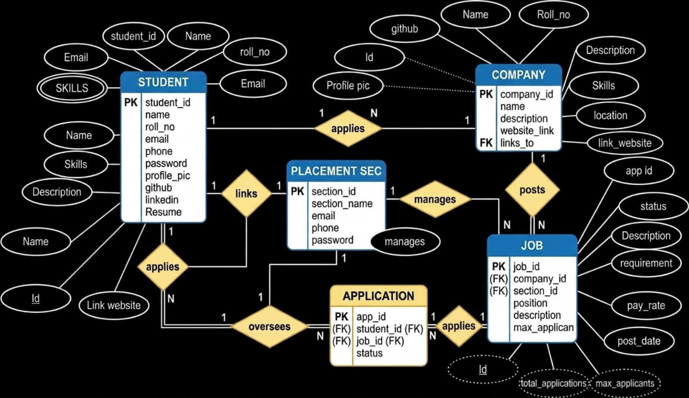

TEAM MEMBERS

Ayush Singh Rawat 24/94078 (Frontend + Database)

Sidhharth Kasana 24/94017 (Frontend)

Yagya 24/94018 (Backend + Database)


🎓 Placement Management System

## 📌 Overview

The **Placement Management System** is a web-based application designed to simplify and automate the placement process in colleges and universities. The platform provides a centralized system where students can apply for jobs and companies can recruit candidates efficiently.

Traditional placement processes often involve manual record keeping, spreadsheets, and physical coordination between students, placement cells, and companies. This project aims to digitize the placement workflow, making it easier to manage student information, job postings, and application tracking.

The system is built using **Django (Python) for backend development**, **Bootstrap for the user interface**, and **SQLite for database management**. It demonstrates the practical implementation of **Database Management System (DBMS) concepts**, including relational database design, table relationships, and CRUD operations.

---

# 🎯 Objectives

The main objectives of the Placement Management System are:

- Automate the placement process in educational institutions
- Provide a central platform for students and recruiters
- Reduce manual work and data redundancy
- Maintain a structured database of students, companies, and job applications
- Demonstrate real-world DBMS implementation using Django

---

# 🧑‍💻 System Modules

The system is divided into multiple modules that handle different functionalities.

---

## 👨‍🎓 Student Module

The student module allows students to create profiles and participate in placement activities.

### Features

- Student registration and login
- Profile creation and editing
- View available job opportunities
- Apply for jobs posted by companies
- Track applied jobs
- View job descriptions and eligibility criteria

Students can easily manage their profiles and stay updated with new job opportunities posted by companies.

---

## 🏢 Company Module

The company module allows recruiters to interact with the placement system.

### Features

- Company registration and login
- Create and manage job postings
- View student applications
- Manage job listings

Companies can post job openings with details such as:

- Job title
- Salary package
- Required skills
- Eligibility criteria
- Job description

---

## 📋 Job Management Module

This module manages job postings and applications.

### Features

- Create job postings
- Display available jobs to students
- Track job applications
- Maintain relationships between students, companies, and jobs

Each job is linked to a specific company and students can apply directly through the system.

---

# 🗄️ Database Design

The system uses **SQLite**, which is lightweight and suitable for development and academic projects.

### Main Tables

**Student**
- Roll Number
- Name
- Email
- Phone
- Skills
- Department

**Company**
- Company Name
- Email
- Industry
- Description

**Job**
- Job Title
- Salary
- Required Skills
- Job Description
- Company (Foreign Key)

**Application**
- Student (Foreign Key)
- Job (Foreign Key)
- Application Status

### Relationships

- One Company → Many Jobs  
- One Student → Many Applications  
- One Job → Many Applications  

This relational structure demonstrates key DBMS concepts such as foreign keys and table relationships.

---

# 🛠️ Technology Stack

## Backend
- Python
- Django Framework

Django provides:
- Built-in authentication
- ORM for database management
- Secure and scalable backend

---

## Frontend
- HTML5
- CSS3

---

## Database
- SQLite

SQLite is used because:
- It is lightweight
- No additional installation required
- Perfect for small academic projects

---

# 🗄️ Database Design




# 📂 Project Structure

```
placement-management-system
│
├── placement_system
│   ├── settings.py
│   ├── urls.py
│
├── placement_app
│   ├── models.py
│   ├── views.py
│   ├── forms.py
│   ├── admin.py
│
├── templates
│   ├── base.html
│   ├── home.html
│   ├── student_login.html
│   ├── company_login.html
│
├── static
│   ├── css
│   ├── js
│
├── db.sqlite3
├── manage.py
└── requirements.txt
```

---

# ⚙️ Installation Guide

Follow these steps to run the project locally.

### 1. Clone the Repository

```bash
git clone https://github.com/your-username/placement-management-system.git
```

### 2. Navigate to Project Directory

```bash
cd placement-management-system
```

### 3. Create Virtual Environment 

```bash
python -m venv venv
```

Activate environment:

Windows

```bash
venv\Scripts\activate
```

Mac/Linux

```bash
source venv/bin/activate
```

### 4. Install Dependencies

```bash
pip install -r requirements.txt
```

### 5. Apply Database Migrations

```bash
python manage.py migrate
```

### 6. Run the Development Server

```bash
python manage.py runserver
```

### 7. Open the Application

```
http://127.0.0.1:8000/
```

---

# 📊 DBMS Concepts Demonstrated

This project demonstrates several important Database Management System concepts:

- Relational database design
- Entity relationships
- Primary keys and foreign keys
- Data normalization
- CRUD operations
- Query handling using Django ORM

---

# 🔒 Security Features

The system uses Django’s built-in security mechanisms:

- Password hashing
- Authentication system
- CSRF protection
- Form validation

---

# 🚀 Future Improvements

Possible enhancements include:

- Admin dashboard for placement cell
- Resume upload system
- Email notifications for job updates
- Interview scheduling system
- Job filtering and search features
- Placement analytics dashboard
- REST API for mobile applications

---

# 🎓 Academic Purpose

This project was developed as part of a **Database Management Systems (DBMS) academic project**. It demonstrates how database concepts can be applied to build a real-world web application.

---

# 📜 License

This project is developed for **educational purposes**. Feel free to use and modify it for learning and academic projects.


